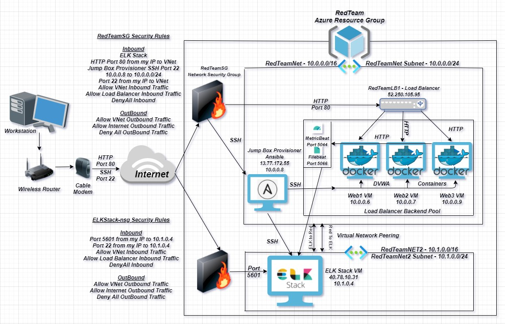
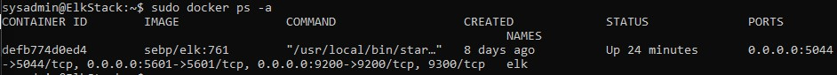

# University of Utah - Cybersecurity Bootcamp
# Automated ELK Stack Project

This repository was used to create and configure an *ELK Stack Server*

Here is a picture of the network diagram as configured

These files have been tested and used to generate a live *ELK deployment* on ***Azure***. They can be used to recreate the entire deployment pictured above. Alternatively, select portions of the *playbook.yml* file may be used to install only certain pieces of it, such as *Filebeat*.

- [Ansible Playbook Installation YAML File](Ansible/myplaybook.yml)
- [Ansible Configuration File](Ansible/ansible.cfg)
- [Ansible Hosts File](Ansible/hosts)
- [ELK Stack Server Installation YAML File](Ansible/Scripts/elk-install.yml)
- [Filebeat Installation YAML File](Ansible/Scripts/filebeat-install.yml)
- [Filebeat Configuration YAML File](Ansible/Scripts/filebeatconfig.yml)
- [Metricbeat Installation YAML File](Ansible/Scripts/metricbeat-install.yml)
- [Metricbeat Configuration YAML File](Ansible/Scripts/metricbeatconfig.yml)

This document contains the following details:
- Description of the Topology
- Access Policies
- ELK Configuration
  - Beats in Use
  - Machines Being Monitored
- How to Use the Ansible Build

### Description of the Topology

The main purpose of this network is to expose a load-balanced and monitored instance of ***DVWA (D@mn Vulnerable Web Application)***.

*Load balancing* ensures that the application will be highly available, in addition to restricting access to the network.

***What aspect of security do load balancers protect?*** Load Balancers add resiliency by adding to the attack surface of a website or server, and can route traffic to other servers if any of the systems become unavailable at any time. It eliminates the single point of failure and reduces the chances of the server slowing down because of exhausted system resources and oversaturated links

***What is the advantage of a jump box?*** A *Jump Box Provisioner* gives users access to a single secure node that is more easily monitored and secured. Also, all of the security tools for the *SAN (Storage Area Network)* are centralized and maintained on one system, so when the *SAN* requires an update, only one system needs to be maintained and updated instead of having multiple systems to take down and update.

Integrating an *ELK server* allows administrators to easily monitor the vulnerable VMs for changes to the data and system logs.  

***What does Filebeat watch for?*** *Filebeat* is a logging agent that is installed on a client machine generating logs. *Filebeat* tails the log files and forwards the data into *Logstash* for advanced processing or *Elasticsearch* for indexing. It watches for changing file hashes in the filesystem and logs the changes and when it was changed.

***What does Metricbeat record?*** *Metricbeat* is used to record and collect metrics and statistics from the operating system and turns the output into charts and graphs that simplify understanding and analyzing the data.

***The configuration details of each machine may be found below.***

| Name          | Function  | IP Address                       | Operating System    |
|---------------|-----------|----------------------------------|---------------------|
| Jump Box      | Gateway   | 10.0.0.8, 13.77.172.55           | Ubuntu 18.04 LTS    |
| Load Balancer | Distribute Network Load | 52.250.105.95 |  Ubuntu 18.04 LTS   |           
| Web1          | Webserver | 10.0.0.6                         | Ubuntu 18.04 LTS    |
| Web2          | Webserver | 10.0.0.7                         | Ubuntu 18.04 LTS    |
| Web3          | Webserver | 10.0.0.9                         | Ubuntu 18.04 LTS    |
| ELKStack      | Logging   | 10.1.0.4, 40.78.10.31            | Ubuntu 18.04 LTS    |

### Access Policies

The machines on the internal network are not exposed to the public Internet. 

Only the *Jump Box Provisioner* machine can accept connections from the Internet. I configured this to only be accessible from my *personal IP* with my own private *SSH key* for the best security results. 

Machines within the network can only be accessed by specific users on the *Jump Box Provisioner* from 10.0.0.8.

A summary of the access policies in place can be found in the table below.

| Name          | Publicly Accessible | Allowed IP Addresses                  |
|---------------|---------------------|---------------------------------------|
| Jump Box      | Yes                 | Personal IP, 10.0.0.0/16, 10.1.0.4    |
| Load Balancer | Yes                 | Personal IP, 10.0.0.0/16              |
| Web1          | No                  | 10.0.0.8, 10.1.0.4                    |
| Web2          | No                  | 10.0.0.8, 10.1.0.4                    | 
| Web3          | No                  | 10.0.0.8, 10.1.0.4                    |
| ELKStack      | Yes                 | Personal IP, 10.0.0.0/16, 10.0.0.8 (JumpBox SSH)|

### Elk Configuration

*Ansible* was used to automate configuration of the *ELK machine*. No configuration was performed manually, which is advantageous because it is simplifies setup and does not require an agent running on the system, it is fast and runs functions remotely over ssh, and can be run from the command line without using configuration files for simple tasks.

 - ***The [elk-install.yml](Ansible/Scripts/elk-install.yml) playbook implements the following tasks:***
 - ***Install Docker -*** Installs Docker to the system
 - ***Install Python3-pip -*** Installs Python3-pip to Docker system
 - ***Install Docker module to pip3 -*** Installs a Docker module to Python3-pip for the *ELK Stack*
 - ***Increase Virtual Memory -*** We need to increase virtual memory to use the *ELK Stack* container, so we will run this command and increase virtual memory to ***262144*** and will take effect upon the next system restart.
 - ***Download and launch a Docker ELK Container -*** Will download the ***sepb/elk:761*** container and start the installation process, as well as list the published ports for the ***ELK Stack***: ***5601 (Kibana)***, ***9200 (ElasticSearch)*** and ***5044 (Filebeat)***.
 - ***Enable Docker system service on boot -*** Enables the Docker system service when the system is started
 - Here is a [screenshot](Images/Elk/elk-install.jpg) of the output you should see when you're running the ***[elk-install.yml](Ansible/Scripts/elk-install.yml).***

The following screenshot displays the result of running ***docker ps*** after successfully configuring the *ELK* instance.

### Target Machines & Beats
***This ELK server is configured to monitor the following machines:*** 
- ***Web1 - 10.0.0.6***
- ***Web2 - 10.0.0.7***
- ***Web3 - 10.0.0.9***

***We have installed the following Beats on these machines:*** 
- ***Filebeat 7.6.2***
- ***Metricbeat 7.6.1***

These Beats allow us to collect the following information from each machine:

- ***- Filebeat -*** Collects systemwide file changes by monitoring log events and forwarding that information to ElasticSearch and LogStash for indexing and centralizing the log data.
- ***- Metricbeat -*** Collects system metrics from services and applications that are running on the server and outputs them into *ElasticSearch* and *LogStash* to make it  easier to monitor application and system performance as well as troubleshooting potiential problems.

### Using the Playbooks
In order to use the playbook, you will need to have an *Ansible control node* already configured. Assuming you have such a control node provisioned: 

SSH into the control node and follow the steps below:

### Installing the ELK Stack

- Copy the ***[elk-install.yml](Ansible/Scripts/elk-install.yml)*** file to ***/etc/ansible/files***.
- Update the hosts file to include the Private IPs of the *webservers* and *elkserver* to the *ElasticSearch* and *Kibana* sections of the configuration files
- Run ***[ansible-playbook elk-install.yml](Images/Elk/elk-install.jpg)*** to run the playbook installation process
- Run ***[curl localhost/setup.php](Images/VM/localhost_elk.jpg)*** before leaving the command prompt to make certain you are getting output.
- Navigate to ***[http://<ELK Stack VM Public IP*>*:5601/app/kibana#/home](Images/Kibana/KibanaHome1.jpg)*** to check that the installation worked as expected.
 
### Installing Filebeat 

- Copy the ***[filebeat-install.yml](Ansible/Scripts/filebeat-install.yml)*** and the ***[filebeatconfig.yml](Ansible/Scripts/filebeatconfig.yml)*** to the **/etc/ansible/files folder**
- Run ***[ansible-playbook filebeat-install.yml](Images/Filebeat/filebeat-install.jpg)*** to run the installation process for filebeat to ensure correct installation.
- Navigate to ***[http://ELK Stack VM Public IP:5601/app/kibana#/home](Images/Kibana/KibanaHome1.jpg)***
- Click on the ***[Add log data tab](Images/Kibana/Add_log_data.jpg)***
- Then go to the ***[System logs window](Images/Kibana/System_logs.jpg)***
- Scroll to the bottom of the page, to the ***[Module Status](Images/Kibana/Mod_status.jpg)***
- If installation of Filebeat was successful, you can click on the ***[Check data tab](Images/Kibana/Mod_status_success.jpg)*** to see if you have any input being received.

### Installing Metricbeat 

- Copy the ***[metricbeat-install.yml](Ansible/Scripts/metricbeat-install.yml)*** and the ***[filebeatconfig.yml](Ansible/Scripts/metricbeatconfig.yml)*** to the **/etc/ansible/files folder**
- Run ***[ansible-playbook metricbeat-beat.yml](Images/Metricbeat/metricbeat-install.jpg)*** to run the installation process for filebeat
- Navigate to ***[http://ELK Stack VM Public IP:5601/app/kibana#/home](Images/Kibana/KibanaHome1.jpg)***
- Click on the ***[Add Metric data tab](Images/Kibana/Add_metric_data.jpg)***
- Then go to the ***[Docker Metrics window](Images/Kibana/Docker_metrics.jpg)***
- Scroll to the bottom of the page, to the ***[Module Status](Images/Kibana/Mod_status.jpg)***
- If installation of Filebeat was successful, you can click on the ***[Check data tab](Images/Kibana/Mod_status_success.jpg)*** to see if you have any input being received.

#### After installing Playbooks

- Run the ***sudo apt update && sudo apt upgrade -y*** to update and upgrade all system files on each of the virtual machines to get the latest security updates and upgrades.
